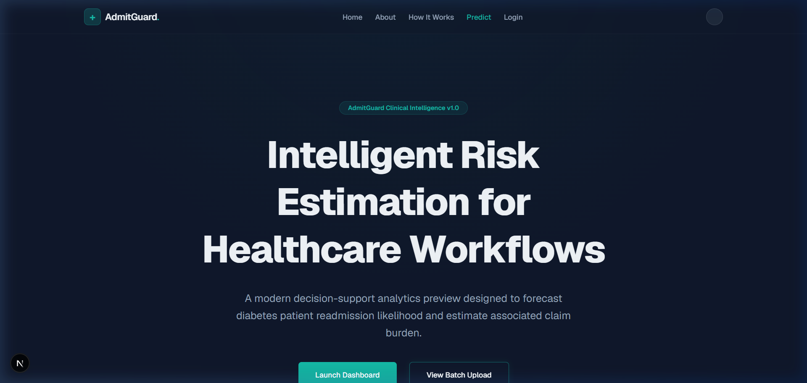
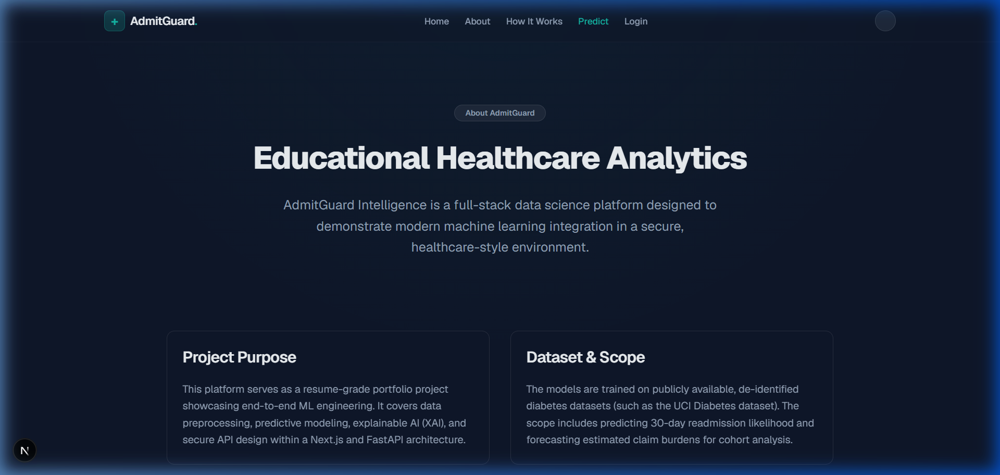
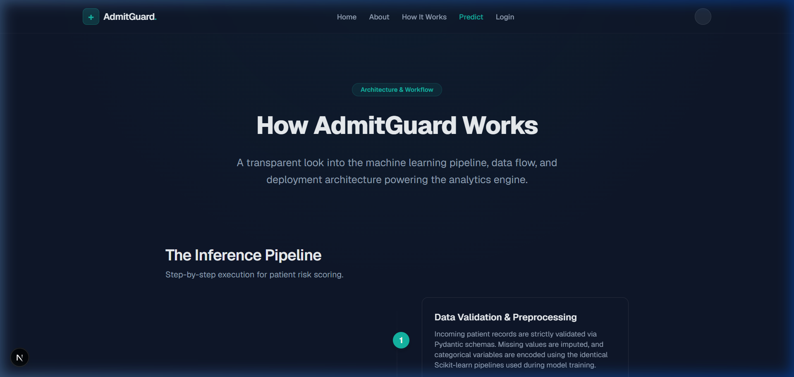
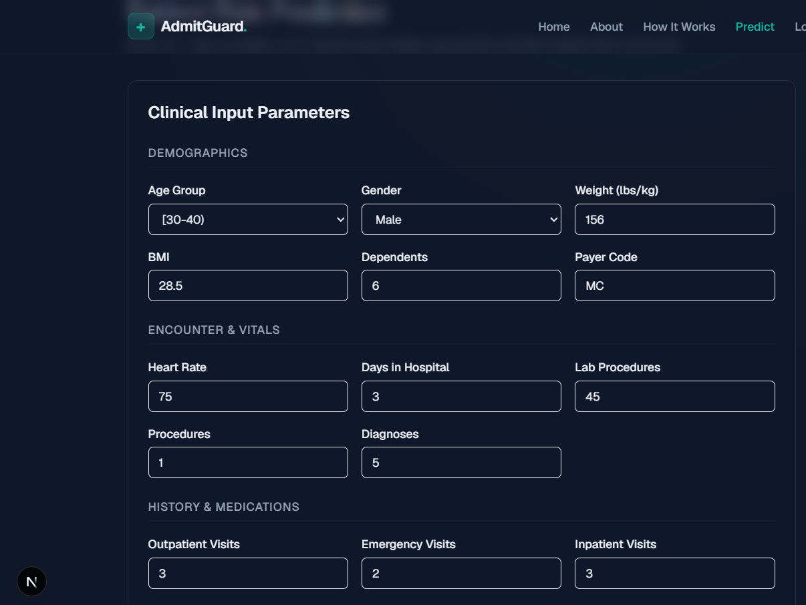
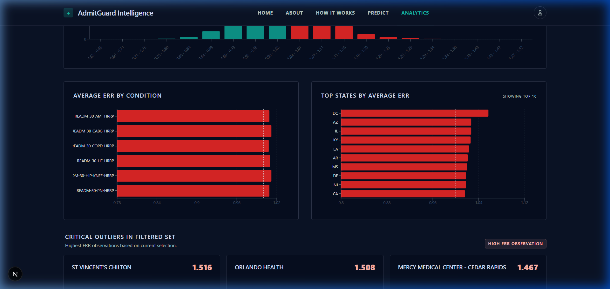
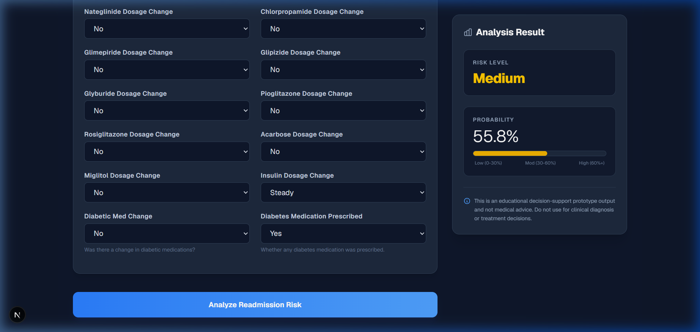

# AdmitGuard Intelligence

> A clinical decision-support and analytics prototype providing patient readmission risk estimation and estimated insurance claim analytics.

### 🌐 [Live Demo (admitguard.site)](https://admitguard.site)
*Note: The backend is hosted on a free Render instance and may take 30-60 seconds to wake up on the first request.*

## 📌 Problem Statement
Hospital readmissions are a critical quality metric and financial liability for healthcare organizations. Accurately identifying high-risk patients prior to discharge allows clinical teams to intervene with targeted care plans, reducing the likelihood of avoidable readmissions. Simultaneously, understanding estimated insurance claim amounts helps financial planning and resource allocation. AdmitGuard serves as a foundational prototype to bridge clinical operational data with machine learning, enabling proactive risk management.

## ✨ Key Features
- **Readmission Risk Estimation**: Predicts 30-day readmission probability using 32 pre-outcome clinical features (leak-safe).
- **Claim Analytics**: Estimates financial claim amounts based on 12 patient demographic and history features.
- **Hospital Benchmarking**: Aggregate performance analytics for ~2,000 hospitals using the CMS HRRP dataset.
- **Unified Dashboard**: A polished, responsive web interface built with modern glassmorphism UI for clear presentation.
- **Robust Architecture**: Modular FastAPI backend supporting dual-model concurrent inference, strictly decoupled from the Next.js frontend.
- **Safe ML Pipeline**: Fully reproducible `scikit-learn` pipeline with rigorous anti-leakage guards (ensuring post-outcome variables do not corrupt training).

## 🛠 Tech Stack
- **Frontend**: Next.js 16 (App Router), React, Tailwind CSS, TypeScript
- **Backend**: FastAPI, Python 3.12, Pydantic, SQLAlchemy 2.0
- **Machine Learning**: Scikit-Learn, Pandas, NumPy, Joblib

## 🏗 Architecture Overview
AdmitGuard operates on a segregated Client-Server architecture:
1. **Next.js Client**: Provides the recruiter-ready UI. Requests are routed via `src/lib/api.ts` concurrently using `Promise.allSettled`.
2. **FastAPI Microservice**: Handles inference via two distinct routes: `/api/v1/readmission/predict` and `/api/v1/claim/predict`.
3. **ML Pipeline**: A local `ml/` environment that processes the raw dataset, maps variables, scales features, and exports `.joblib` binary artifacts consumed by the FastAPI service.

*(See [Architecture Docs](docs/architecture/README.md) for more details)*

## 🧠 ML Models Used
The system trains on two separate, task-specific datasets to avoid feature leakage and ensure data integrity. The previous fused dataset (`final_adjusted_healthcare_dataset.xlsx`) is invalid and must **not** be used or recreated.

### Readmission Risk Model (Classification)
- **Dataset**: `diabetic_data.csv` (101,766 rows)
- **Algorithm**: Logistic Regression (with class weight balancing)
- **Metrics** (Realistic due to leakage removal): 
  - Accuracy: 0.648
  - Recall: 0.538
  - Macro-F1: 0.514
  - ROC-AUC: 0.637

### Claim Prediction Model (Regression)
- **Dataset**: `healthinsurance_claims.csv` (13,904 deduplicated rows)
- **Algorithm**: Random Forest Regressor
- **Metrics** (Strong but dataset-specific): 
  - MAE: 558.89
  - RMSE: 2047.77
  - R2: 0.972
  - MAPE: 6.31%

### Hospital Analytics (Benchmarking)
- **Dataset**: `hrrp_readmissions.csv` (7,890 records)
- **Scope**: 1,960 unique hospitals across 34 US states.
- **Primary Metric**: Excess Readmission Ratio (ERR).
- **Nature**: Static historical aggregate data (Jul 2019 – Jun 2022). This is **not** an ML model output but a display of CMS-calculated statistics.

## ⚠️ Important Notes
- **Dataset Note**: The project uses separate, task-specific datasets. The raw datasets are locally stored in `data/raw/` and explicitly ignored by Git.
- **Artifact Note**: Large binary `.joblib` model artifacts are also ignored by `.gitignore`. They must be generated locally using the training scripts before running the backend locally.
- **Disclaimer**: This platform is a *prototype/decision-support tool*. It is **not** HIPAA compliant, does **not** have clinical approval, and does **not** provide medical or financial advice.

## 🌐 Live Deployment
AdmitGuard is live and accessible for demonstration:
- **Frontend**: [admitguard.site](https://admitguard.site) (Deployed on Vercel via Namecheap)
- **Backend API**: [admitguard-api.onrender.com](https://admitguard-api.onrender.com) (Deployed on Render)
- **API Documentation**: [Interactive Swagger UI](https://admitguard-api.onrender.com/docs)
- **Analytics Data**: [Public JSON Summary](https://admitguard-api.onrender.com/api/v1/analytics/summary)

*Note: As this uses Render's free tier, the backend may "spin down" after inactivity. If the app appears slow initially, please allow up to 60 seconds for the service to wake up.*

## 🚀 Local Setup Instructions

### 1. Training the Models (Required First)
Because artifacts are not committed, you must build the models locally.
1. Place the datasets (`diabetic_data.csv` and `healthinsurance_claims.csv`) into `data/raw/readmission/` and `data/raw/claims/` respectively.
2. Open a terminal at the project root and activate the environment:
   ```bash
   .venv\Scripts\activate
   ```
3. Run the training scripts:
   ```bash
   python ml/src/train_readmission.py
   python ml/src/train_claim.py
   ```
   *(This generates the `.joblib` files inside `ml/artifacts/` or `ml/models/`)*

### 2. Running the Backend
1. Ensure the virtual environment is activated.
2. From the project root, start FastAPI:
   ```bash
   cd backend
   uvicorn app.main:app --reload --port 8000
   ```

### 3. Running the Frontend
1. Open a new terminal at the project root.
2. Install dependencies (if not done) and start Next.js:
   ```bash
   cd frontend
   pnpm install
   pnpm dev
   ```
3. Navigate to `http://localhost:3000` to view the dashboard.

## 📡 API Endpoint Summary
- `GET /api/v1/health/` - Backend health check
- `GET /api/v1/analytics/summary` - Returns aggregate HRRP hospital benchmarking data.
- `POST /api/v1/readmission/predict` - Accepts ReadmissionRequest (32 features) and returns risk probability/label.
- `POST /api/v1/claim/predict` - Accepts ClaimRequest (12 features) and returns estimated USD claim amount.

*(See [API Docs](docs/api/README.md) for payload definitions)*

## 🔮 Limitations & Future Improvements
- **Limitations**: The models currently assume structured tabular data and are trained on static datasets. The models are dataset-specific.
- **Improvements**: Integration with live FHIR/HL7 streams, Dockerization for cloud deployment, and implementing user authentication/RBAC for secure provider access.

## 📋 Next Steps
1. Final project hand-off and portfolio polish.
2. Optional SHAP/Explainability integration for prediction drivers.
3. Dashboard filtering by condition or state.

---

## 📸 Screenshots







