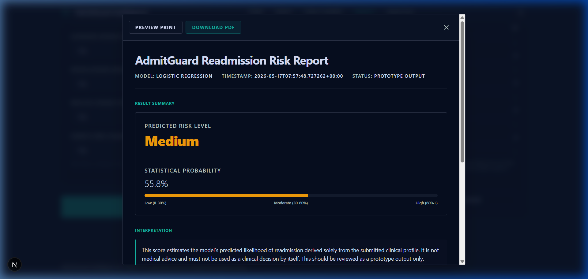
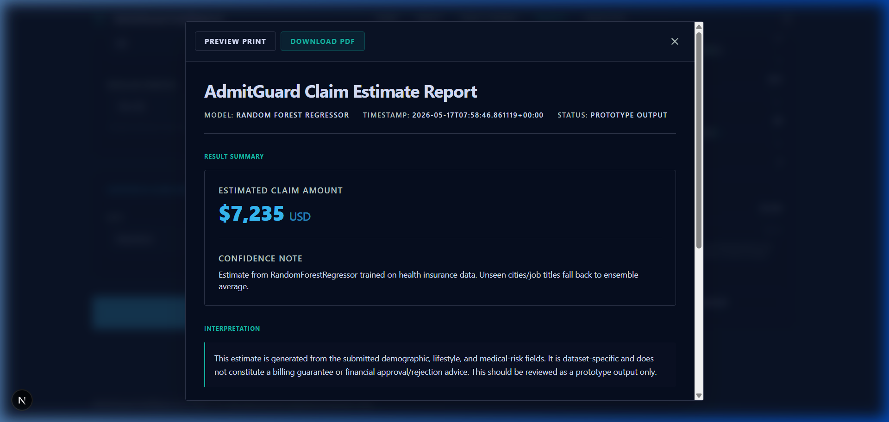

# AdmitGuard Intelligence

> A premium clinical decision-support and analytics platform providing patient readmission risk estimation, claim billing bounds estimation, and interactive hospital benchmarking.

### 🌐 [Live Demo (admitguard.site)](https://admitguard.site) | 📡 [Interactive Swagger API Docs](https://admitguard-api.onrender.com/docs)
*Note: The backend is hosted on Render's free tier and may take 30–60 seconds to spin up on the first request.*

---

## 📌 Problem Statement
Hospital readmissions are a critical quality metric and financial liability under the CMS Hospital Readmissions Reduction Program (HRRP). Proactively identifying high-risk patients before discharge allows clinical teams to deploy transition-of-care interventions. Simultaneously, understanding billing limits helps operational teams anticipate claim limits and manage medical loss ratios. 

**AdmitGuard** bridges these clinical and financial spaces. It processes individual patient profiles against ML models and offers an interactive aggregate explorer to benchmark performance across 2,000+ US hospitals.

---

## ✨ Key Features

- **🧠 Double ML Prediction Engine**:
  - **Patient Readmission Risk (Classification)**: Predicts 30-day readmission risk using 32 pre-outcome clinical features with strict data leak-safety.
  - **Patient Claim Estimation (Regression)**: Estimates total claim cost bounds based on 12 demographic and clinical features.
- **📊 Dataset Baseline Visualizations**:
  - Visualizes patient indicators relative to historical medians and Interquartile Ranges (IQR) using shaded horizontal bullet charts.
  - Strictly framed as non-causal descriptive references with professional clinical disclaimers.
- **📈 Interactive Analytics Explorer**:
  - Hospital-level benchmarking explorer utilizing high-performance **Recharts** visualizations.
  - Real-time dynamic filtering by **US State**, **Medical Condition**, and **Top-N Outliers**.
- **📄 Vector-Native PDF Reports**:
  - Client-side downloadable PDFs generated via `@react-pdf/renderer` for both predictions and analytics.
  - Custom vector graphics faithfully reproduce web-based distributions and bullet charts inside the PDF with no context loss offline.
- **💎 Dark Clinical Design**:
  - Fully responsive, Stitch-inspired dark glassmorphism layout optimized for modern medical workstations.

---

## 🛠 Tech Stack
- **Frontend**: Next.js 16 (App Router), React, TypeScript, Tailwind CSS, Recharts, React-PDF
- **Backend**: FastAPI, Python 3.12, Pydantic, SQLAlchemy 2.0, Uvicorn
- **Machine Learning**: Scikit-Learn, Pandas, NumPy, Joblib

---

## 🏗 Architecture Overview
AdmitGuard operates on a segregated, decoupled client-server architecture:
1. **Next.js Client**: Premium, recruiter-ready clinical dashboard interface. Calls APIs concurrently utilizing `Promise.allSettled` to optimize performance.
2. **FastAPI Microservice**: Dual-model concurrent inference engine mapping endpoints:
   - `/api/v1/readmission/predict`
   - `/api/v1/claim/predict`
   - `/api/v1/analytics/explore` *(dynamic state/condition filter queries)*
3. **ML Pipeline**: Modular training environments in `ml/` producing reproducible `.joblib` model binaries.

*(See [Architecture Docs](docs/architecture/README.md) for deeper implementation details)*

---

## 🧠 Model Specifications & Baselines

### Readmission Risk Model (Classification)
- **Dataset**: `diabetic_data.csv` (101,766 records)
- **Algorithm**: Logistic Regression (balanced class weights)
- **Primary Metrics**: Accuracy: 0.648 | Recall: 0.538 | ROC-AUC: 0.637

### Claim Prediction Model (Regression)
- **Dataset**: `healthinsurance_claims.csv` (13,904 records)
- **Algorithm**: Random Forest Regressor
- **Primary Metrics**: MAE: 558.89 | R²: 0.972 | MAPE: 6.31%

### Hospital Analytics Benchmarking (Aggregate CMS Data)
- **Dataset**: `hrrp_readmissions.csv` (7,890 records)
- **Metrics**: Excess Readmission Ratio (ERR) distributions across 1,960 hospitals.
- **Nature**: Historical aggregate reference dataset. Not predictive; used strictly for descriptive benchmarking.

---

## ⚠️ Important Disclaimers & Safety
- **Descriptive Benchmarking**: Comparison indicators display historical statistical distributions. They are **not** explaining causality or model feature importance.
- **Compliance & Prototype Framing**: AdmitGuard is a research prototype designed to showcase engineering proficiency. It is **not** HIPAA-compliant, does not have clinical clearance, and must not be used for direct medical diagnoses or billing decisions.

---

## 🚀 Local Setup Instructions

### 1. Precompute Model Binaries (Required First)
Because compiled binary models are excluded from Git:
1. Place raw datasets (`diabetic_data.csv` and `healthinsurance_claims.csv`) in `data/raw/readmission/` and `data/raw/claims/` respectively.
2. Activate your virtual environment and run the training scripts:
   ```bash
   .venv\Scripts\activate
   python ml/src/train_readmission.py
   python ml/src/train_claim.py
   ```
3. Generate the precomputed baseline statistical bounds:
   ```bash
   python ml/scripts/generate_baselines.py
   ```

### 2. Run the Backend API
```bash
cd backend
uvicorn app.main:app --reload --port 8000
```

### 3. Run the Frontend Dashboard
```bash
cd frontend
pnpm install
pnpm dev
```
Navigate to `http://localhost:3000` to interact with the system locally.

---

## 📸 Screenshots & Visual Interface

### 1. Sleek Hospital Landing Page


### 2. Interactive Benchmarking Analytics (Recharts-powered)


### 3. Patient Predict Form & Baseline bullet charts


### 4. Vector PDF Clinical Summaries (React-PDF)
| Readmission Report | Financial Claim Report |
|---|---|
|  |  |

---

## 📡 API Endpoint Reference
- `GET /api/v1/health/` — API active status check.
- `POST /api/v1/readmission/predict` — Accepts patient data (32 inputs) & returns risk probability + descriptive benchmarks.
- `POST /api/v1/claim/predict` — Accepts claim parameters & returns expected cost bounds + baseline comparative statistics.
- `POST /api/v1/analytics/explore` — Accepts query filters (State, Condition, Top-N Outliers) & returns real-time HRRP benchmarking tables and visual statistics.

---

## 📋 Project Verification
- **Build Verification**: `pnpm build` completes with zero Turbopack compilation errors.
- **API Status**: Healthy FastAPI server verified locally and deployed on Render.
- **Clinical Aesthetics**: Unified clinical dark theme with fluid routing and no placeholders.
